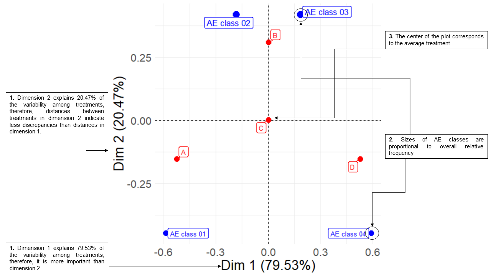

```{r, include = FALSE}
knitr::opts_chunk$set(
  collapse = TRUE,
  comment = "#>"
)
```

The R package [`visae`](https://CRAN.R-project.org/package=visae) implements 'shiny' apps to visualize adverse events (AE) based on the Common Terminology Criteria for Adverse Events (CTCAE).

## Installation
``` r
instal.packages("visae")
```
The latest version can be installed from GitHub as follows:
``` r
devtools::install_github("dnzmarcio/mice")
```

## Stacked Correspondence Analysis

### Generating minimal dataset

```r
patient_id <- 1:4000
group <- c(rep("A", 1000), rep("B", 1000), rep("C", 1000), rep("D", 1000))
ae_grade <- c(rep("AE class 01", 600), rep("AE class 02", 300), 
              rep("AE class 03", 100), rep("AE class 04", 0),
              rep("AE class 01", 100), rep("AE class 02", 400), 
              rep("AE class 03", 400), rep("AE class 04", 100),
              rep("AE class 01", 233), rep("AE class 02", 267), 
              rep("AE class 03", 267), rep("AE class 04", 233),
              rep("AE class 01", 0), rep("AE class 02", 100), 
              rep("AE class 03", 300), rep("AE class 04", 600))
              
dt <- tibble(patient_id = patient_id, trt = group, ae_g = ae_grade)
```

### Investigating different CA configurations using the Shiny application
``` r
library(visae)
library(magrittr)
library(dplyr)
dt %>% run_ca(., group = trt,
             id = patient_id,
             ae_grade = ae_g)
```

### Plotting CA biplot as ggplot object
```r
ca <- dt %>% ca_ae(., group = trt,
              id = patient_id,
              ae_class = ae_g,
              contr_indicator = FALSE,
              mass_indicator = TRUE,
              contr_threshold = 0,
              mass_threshold = 0)
ca$asymmetric_plot
```

### Interpreting biplots for Correspondence Analysis

Investigators often interpret CA biplots erroneously assuming that the distance between AE classes dots and treatments dots is an indicative of association.
See step by step to interpret biplots correctly are below:

#### 1. Minimum example dataset


#### 2. Interpreting percentage of explained variability by dimensions, center average treatment and AE dot sizes


#### 3. Interpreting dimensions and associations between treatments and AEs


#### 4. Comparing treatments and avoiding misleading interpretations


## References
- [Diniz, M.A., Gresham, G., Kim, S. et al. Visualizing adverse events in clinical trials using correspondence analysis with R-package visae. BMC Med Res Methodol 21, 244 (2021). https://doi.org/10.1186/s12874-021-01368-w](https://bmcmedresmethodol.biomedcentral.com/articles/10.1186/s12874-021-01368-w).
